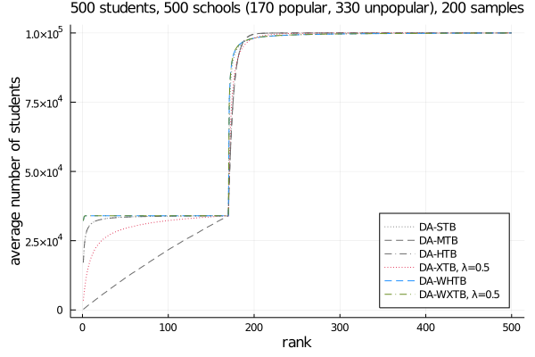
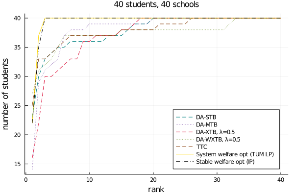

# DeferredAcceptance

&hellip; is an efficient Julia implementation of a few variations of the deferred acceptance algorithm, which produce stable, incentive-compatible solutions to school-choice problems.

Here is a cool graph, produced by the script `MakePlotsHybrid.jl`:

It compares the cumulative rank distributions associated with various DA tiebreaking rules in a simulated school-choice market involving 120 students and 120 seats. In overdemanded (popular) schools, single tiebreaking (STB) yields both better student welfare and greater equity than multiple tiebreaking (MTB), but MTB produces a more equitable distribution in underdemanded schools. A hybrid tiebreaking rule yields the best of both, but requires clairvoyance about which schools are popular and unpopular, a distinction that is less clear in real-world data (Ashlagi and Afshin, 2020). Thus, a tiebreaking rule of my own creation (convex tiebreaking, XTB), parameterized in &lambda;, allows the market designer to freely modulate the welfare&ndash;equity tradeoff between MTB and STB without prior information about the relative popularity of the schools.

To discover a further extreme of the welfare-equality tradeoff phenomenon in underdemanded markets, we can use students&mdash; preference lists as primary tiebreakers; then, any of the four methods above can be used to break the remaining ties. This welfare tiebreaking rule (WTB) reflects the realistic assumption that a given school marginally prefers students who prefer it. WTB dominates STB in overdemanded markets, and in all markets, the difference between WXTB and WHTB vanishes, which suggests that WTB&rsquo;s output has some interesting properties that I intend to investigate formally.  

Considering the problem from a game-theoretic point of view invites us to compare the stable assignments produced by DA algorithms with the welfare-optimal assignment produced by relaxing the stability constraint. We can compute the latter using integer programming, as well as optimize for total (equivalently, average) welfare subject to stability. Integer programming is instractable for large problems, but here are the results of a single 40-by-40 example, this time where all schools are of equivalent popularity and the market is underdemanded:

The code for this example can be found in the `sysopt/` directory. I used FICO Xpress to solve the integer programs; unfortunately, Xpress is closed source, but my scripts are compatible with the limitations imposed by FICO&rsquo;s free community license.

The code in this repository is much more performant than the Python code for the Gale-Shapley algorithm that lives [here](https://github.com/maxkapur/assignment), and thus I would recommend using this code to actually generate stable assignments in large problems. A 1000-by-1000 hybrid market like that shown above takes 17 seconds on my unremarkable computer (bear in mind that overdemanded markets can take much longer).

However, the Python code has a few additional features particular to the one-to-one marriage problem that are of independent interest&mdash;namely, it can solve for the optimal stable marriage given an arbitrary linear cost function.

For a discussion of the DA-MTB and DA-STB tiebreaking rules and a few experimental results which I have reproduced in the `plots/` directory, consult the following reference:

- Ashlagi, Itai and Afshin Nikzad. 2020. &ldquo;What Matters in School Choice Tie-Breaking? How Competition Guides Design.&rdquo; *Journal of Economic Theory* 190 (Oct.), article no. 105120.

The author&rsquo;s homepage is [maxkapur.com](https://www.maxkapur.com/). 
