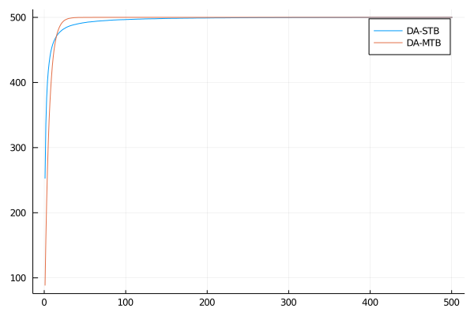

# DeferredAcceptance

&hellip; is a superfast Julia implementation of a few variations of the deferred acceptance algorithm, which produce stable, incentive-compatible solutions to school-choice problems.

For a discussion of the DA-MTB and DA-STB algorithms and a few experimental results which I have attempted to reproduce here, consult the following reference:

- Ashlagi, Itai and Afshin Nikzad. 2020. &ldquo;What Matters in School Choice Tie-Breaking? How Competition Guides Design.&rdquo; *Journal of Economic Theory* 190, article no. 105120.

Here is a cool graph:

It compares the cumulative rank distributions associated with the DA-MTB and DA-STB algorithms in a school-choice market that has a surplus of one seat. In this case, DA-STB yields more highly preferred placements, but DA-MTB yields lower variance and is thus arguably more equitable. 

The code in this repository is much more performant than the Python code that lives [here](https://github.com/maxkapur/assignment) and, as a generalization of the Gale-Shapley algorithm, can also compute stable marriages. However, the Python code has a few additional parameters particular to the marriage problem that are of independent interest.

The author&rsquo;s homepage is [maxkapur.com](https://www.maxkapur.com/). 
