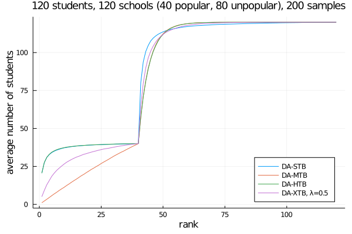

# DeferredAcceptance

&hellip; is an efficient Julia implementation of a few variations of the deferred acceptance algorithm, which produce stable, incentive-compatible solutions to school-choice problems.

Here is a cool graph:

It compares the cumulative rank distributions associated with various DA tiebreaking rules in a simulated school-choice market involving 120 students and 120 seats. In overdemanded (popular) schools, DA-STB yields both better student welfare and greater equity than DA-MTB, but DA-MTB produces a more equitable distribution in underdemanded schools. A hybrid tiebreaking rule yields the best of both, but requires clairvoyance about which schools are popular and unpopular, a distinction that is less clear in real-world data (Ashlagi and Afshin, 2020). Thus, a tiebreaking rule of my own creation (DA-XTB), parameterized in &lambda;, allows the market designer to freely modulate the welfare&ndash;equity tradeoff between MTB and STB without prior information about the relative popularity of the schools.

The code in this repository is much more performant than the Python code for the Gale-Shapley algorithm that lives [here](https://github.com/maxkapur/assignment), and thus I would recommend using this code to actually generate stable assignments in large problems. A 1000-by-1000 hybrid market like that shown above takes 17 seconds on my unremarkable computer (bear in mind that overdemanded markets can take much longer).

However, the Python code has a few additional features particular to the one-to-one marriage problem that are of independent interest&mdash;namely, it can solve for the optimal stable marriage given an arbitrary linear cost function.

For usage examples, consult `MakePlotsHybrid.jl`, which is better annotated than the other one. 😂

For a discussion of the DA-MTB and DA-STB tiebreaking rules and a few experimental results which I have reproduced in the `plots/` directory, consult the following reference:

- Ashlagi, Itai and Afshin Nikzad. 2020. &ldquo;What Matters in School Choice Tie-Breaking? How Competition Guides Design.&rdquo; *Journal of Economic Theory* 190 (Oct.), article no. 105120.

The author&rsquo;s homepage is [maxkapur.com](https://www.maxkapur.com/). 
